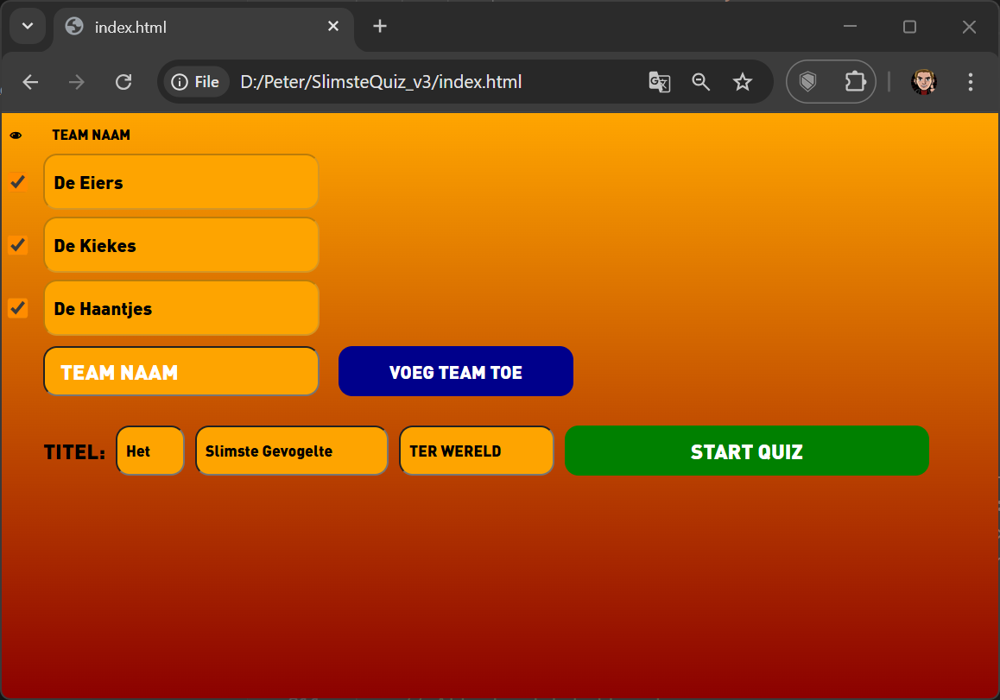
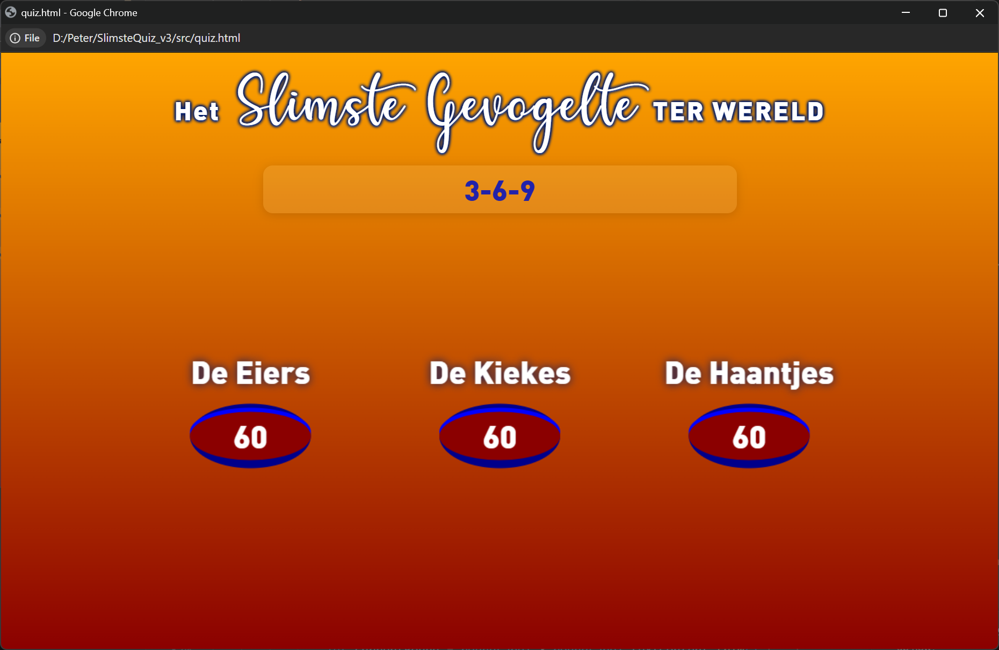
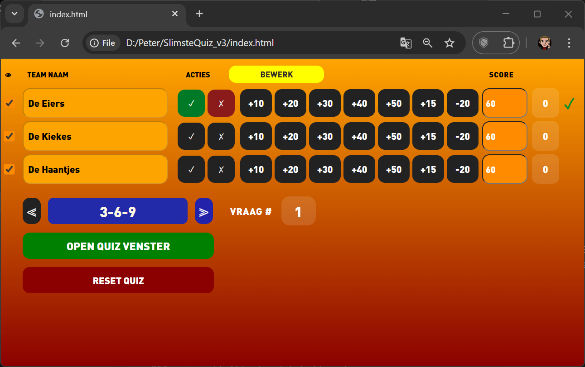
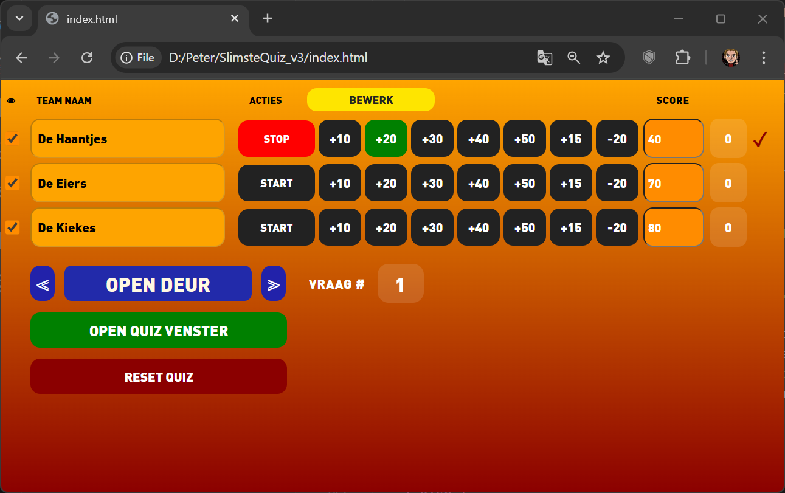
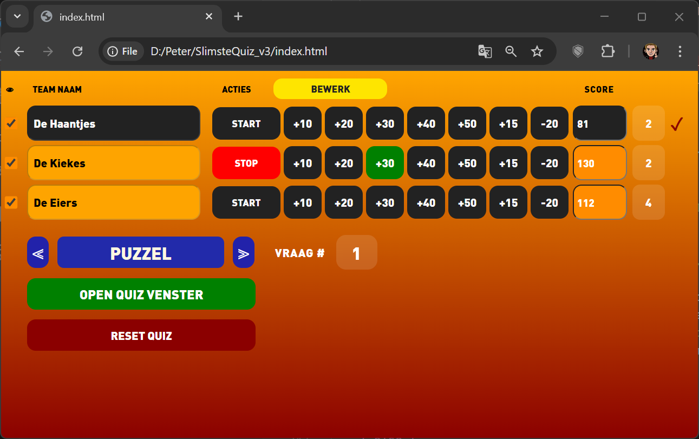
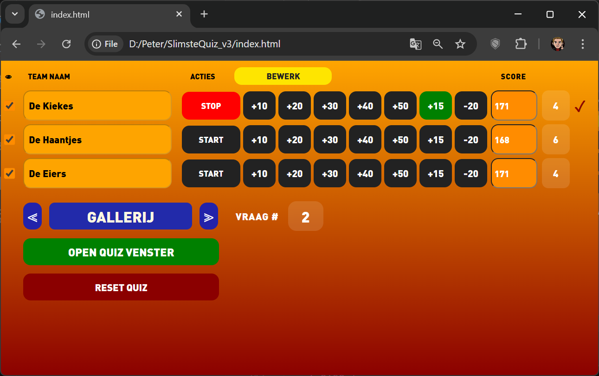
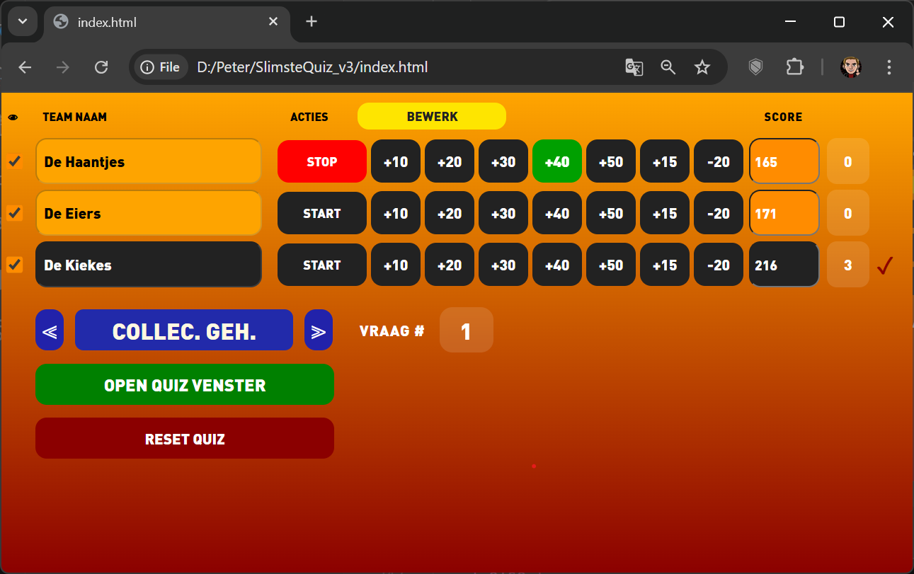
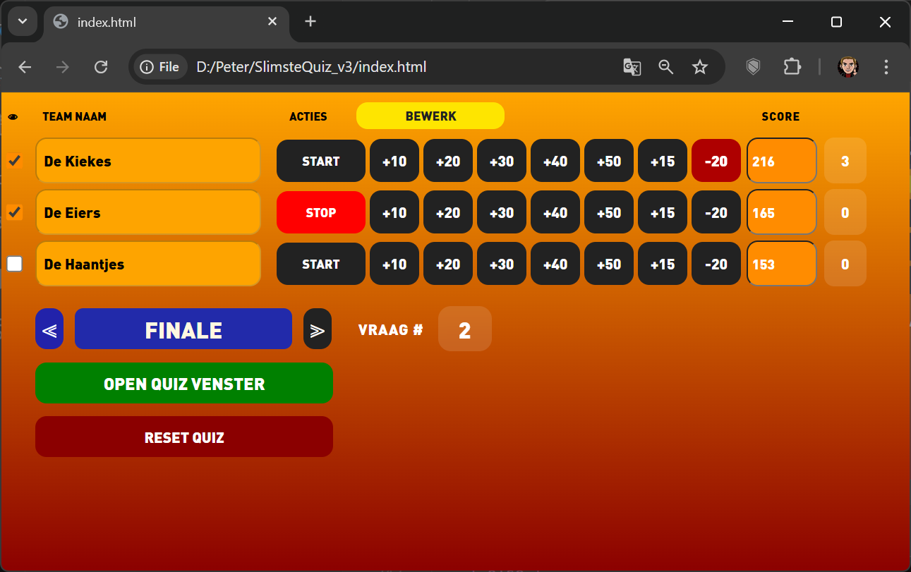

# SlimsteQuiz

Web app om een slimste quiz te organiseren.

Gebruik `index.html` om teams toe te voegen en de quiz te starten.
Hou het quizvenster open en zichtbaar, bij voorkeur op een tweede scherm.

## Voorbeelden

- **Teams aanmaken**  

  

- **Scorebord**  

  

- **3-6-9**  

  

- **3-6-9**  

  

- **Open Deur**  

  

- **Puzzel**  

  

- **Gallerij**  

  

- **Collectief Geheugen**  

  

- **Finale**  

  

- **Winnaar**  

  
